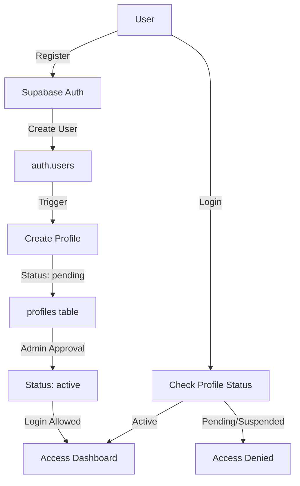
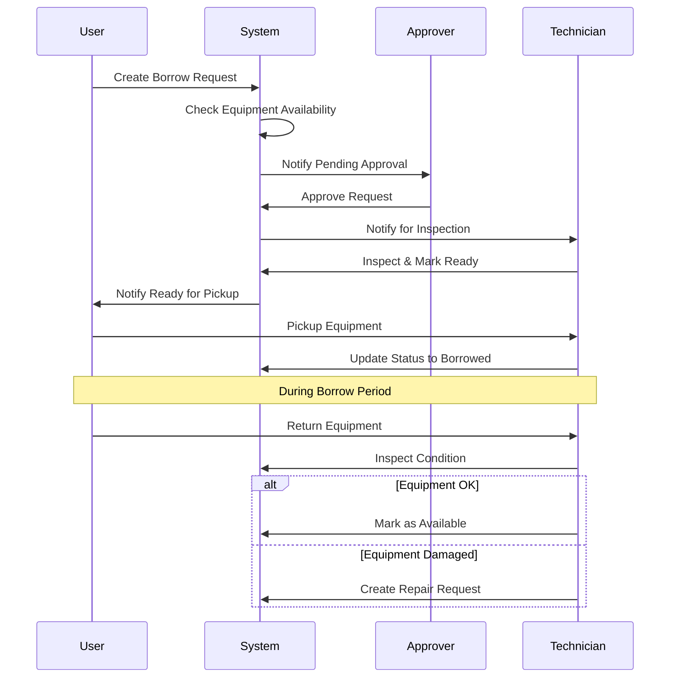

# สถาปัตยกรรมระบบ Yonchuw

## ภาพรวม

ระบบ Yonchuw เป็น Full-stack Web Application ที่สร้างด้วย Next.js 14 และใช้ Supabase เป็น Backend

## Technology Stack

### Frontend
- **Next.js 14** (App Router) - React framework
- **TypeScript** - Type safety
- **Tailwind CSS** - Styling
- **Framer Motion** - Animations
- **Three.js** - 3D graphics
- **Chart.js** - Data visualization

### Backend
- **Supabase** - Backend as a Service
  - PostgreSQL database
  - Authentication
  - Real-time subscriptions
  - Row Level Security (RLS)
  - Storage

### Infrastructure
- **Vercel** - Hosting & CI/CD
- **PWA** - Progressive Web App capabilities

## Database Schema

### Tables

#### `profiles`
```sql
id: uuid (PK, FK to auth.users)
email: text
full_name: text
role: enum (admin, approver, technician, user)
phone: text
department: text
status: enum (pending, active, suspended)
created_at: timestamp
updated_at: timestamp
```

#### `equipment`
```sql
id: uuid (PK)
code: text (unique)
name: text
category: text
brand: text
model: text
status: enum (available, borrowed, repairing, broken)
condition: enum (excellent, good, fair, poor)
description: text
image_url: text
created_at: timestamp
updated_at: timestamp
```

#### `borrow_requests`
```sql
id: uuid (PK)
user_id: uuid (FK to profiles)
equipment_ids: uuid[] (FK array to equipment)
start_date: date
end_date: date
purpose: text
status: enum (pending, approved, rejected, returned, overdue)
approved_by: uuid (FK to profiles)
approved_at: timestamp
created_at: timestamp
updated_at: timestamp
```

#### `repair_requests`
```sql
id: uuid (PK)
equipment_id: uuid (FK to equipment)
reported_by: uuid (FK to profiles)
issue_description: text
status: enum (pending, approved, in_progress, completed, rejected)
assigned_to: uuid (FK to profiles)
cost: numeric
completed_at: timestamp
notes: text
created_at: timestamp
updated_at: timestamp
```

## Authentication Flow



## Request Flow (Borrow)



## Directory Structure

```
src/
├── app/                    # Next.js App Router
│   ├── api/               # API Routes
│   │   ├── auth/         # Authentication endpoints
│   │   ├── borrows/      # Borrow CRUD
│   │   ├── equipment/    # Equipment CRUD
│   │   ├── repairs/      # Repair CRUD
│   │   └── users/        # User management
│   ├── dashboard/         # Dashboard pages
│   ├── login/            # Login page
│   ├── register/         # Register page
│   ├── layout.tsx        # Root layout
│   └── page.tsx          # Landing page
├── components/            # React components
│   ├── ui/               # Reusable UI components
│   ├── effects/          # Animation components
│   └── dashboard/        # Dashboard-specific components
├── lib/                  # Libraries
│   └── supabase/         # Supabase client configs
├── hooks/                # Custom React hooks
├── utils/                # Utility functions
├── types/                # TypeScript type definitions
└── constants/            # App constants
```

## Security

### Row Level Security (RLS)

Supabase RLS policies enforce data access control:

- **Profiles**: Users can read all active profiles, but only update their own
- **Equipment**: Everyone can read, only admin/technician can modify
- **Borrow Requests**: Users can CRUD their own requests, approvers can view all
- **Repair Requests**: Similar to borrow requests

### Environment Variables

Sensitive keys are stored in `.env.local`:
- `NEXT_PUBLIC_SUPABASE_URL` - Public Supabase URL
- `NEXT_PUBLIC_SUPABASE_ANON_KEY` - Public anon key (client-side)
- `SUPABASE_SERVICE_ROLE_KEY` - Admin key (server-side only)

## Performance Optimization

1. **Image Optimization** - Next.js Image component
2. **Code Splitting** - Dynamic imports for heavy components (3D scenes)
3. **Caching** - SWR/React Query for data fetching
4. **PWA** - Service workers for offline support
5. **Server Components** - Reduce client bundle size

## Deployment

### Vercel (Recommended)

1. Push code to GitHub
2. Connect repository to Vercel
3. Set environment variables
4. Deploy

### Environment Setup

Production environment variables:
```env
NEXT_PUBLIC_SUPABASE_URL=your_production_url
NEXT_PUBLIC_SUPABASE_ANON_KEY=your_production_anon_key
SUPABASE_SERVICE_ROLE_KEY=your_production_service_key
```

## Monitoring

- **Error Tracking**: Integrate Sentry (optional)
- **Analytics**: Vercel Analytics or Google Analytics
- **Performance**: Vercel Web Analytics

## Future Enhancements

1. Mobile app (React Native)
2. Email notifications
3. QR code scanning for equipment
4. Advanced reporting with PDF export
5. Integration with external systems
